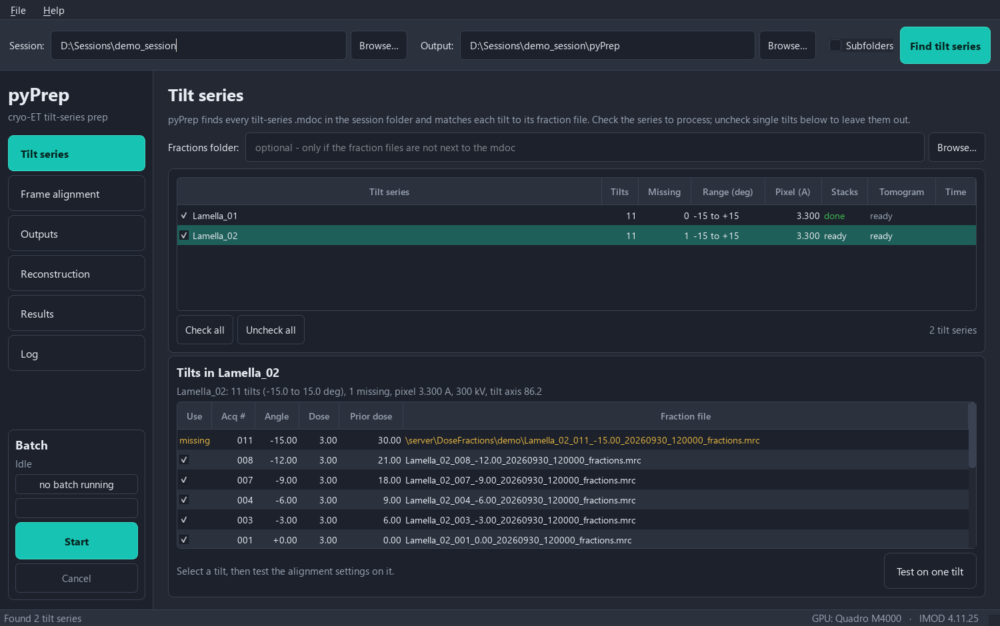
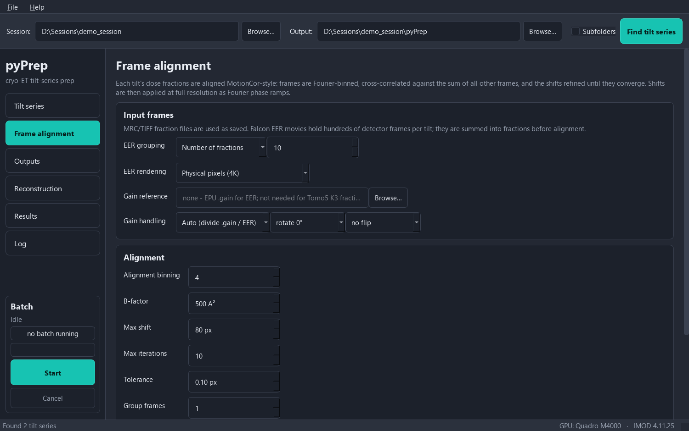
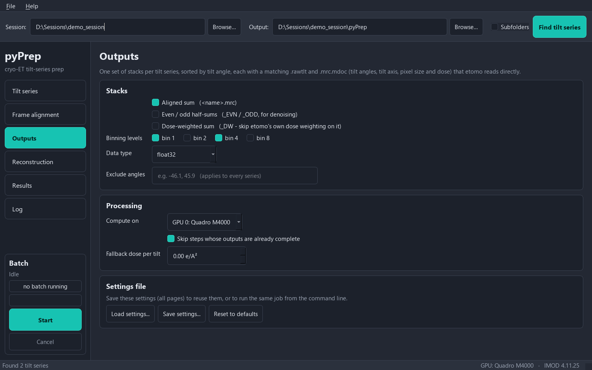
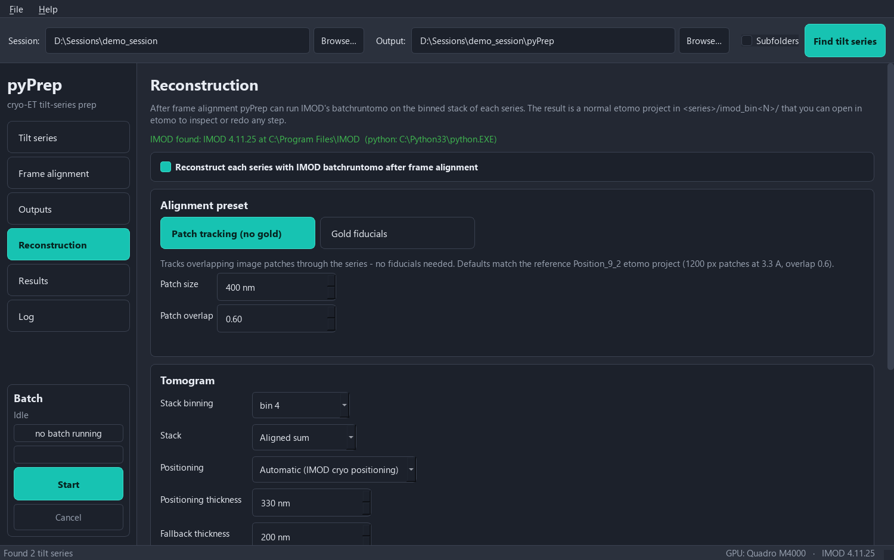
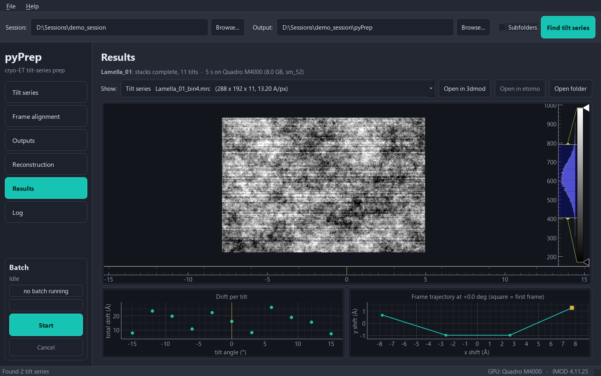

# User guide

This guide walks through a typical session in the pyPrep app. Everything the
app does can also be run from the [command line](command-line.md).

- [What pyPrep needs](#what-pyprep-needs)
- [The window](#the-window)
- [Tilt series](#tilt-series-page)
- [Frame alignment](#frame-alignment-page)
- [Outputs](#outputs-page)
- [Reconstruction](#reconstruction-page)
- [Running a batch](#running-a-batch)
- [Results](#results-page)
- [Log](#log-page)
- [Continuing in etomo](#continuing-in-etomo)
- [Tips](#tips)

## What pyPrep needs

For each tilt series, pyPrep needs:

1. **An `.mdoc` file** written by the microscope software during collection —
   Thermo Fisher **Tomo5** or **SerialEM**. It supplies the tilt angles, the
   order they were collected in, the dose, pixel size, voltage and tilt-axis
   angle, and the name of each tilt's movie file (`SubFramePath`).
2. **The movie / dose-fraction file of every tilt**:
   - MRC fraction files (Tomo5 K3 8-bit fractions, or any MRC mode),
   - TIFF frame stacks,
   - Falcon **EER** files.

The fraction files can be next to the `.mdoc` (or in a `frames` subfolder), or
in a separate folder (for example the `DoseFractions` share) that you give as
the **Fractions folder**. Files are matched by the name in `SubFramePath`
(case-insensitive); Tomo5-style names (`<name>_<nnn>_<angle>_…`) are also
matched by acquisition number.

Missing fraction files are listed and those tilts are skipped — the rest of the
series is still processed.

## The window

- **Top bar** (all pages): the **Session** folder containing the `.mdoc` files,
  the **Output** folder (one subfolder per tilt series is created in it), and
  **Find tilt series**. Tick **Subfolders** to search the session folder
  recursively.
- **Left bar**: the pages, and at the bottom the **Batch** panel with progress,
  **Start** and **Cancel**.
- **Status bar**: the GPU in use and the IMOD version found.

Folders and all settings are remembered between sessions.

## Tilt series page

After **Find tilt series**, the upper table lists every tilt series:

| Column | Meaning |
|---|---|
| Tilt series | name (from the `.mdoc`); the checkbox selects it for processing |
| Tilts / Missing | tilts in the mdoc / tilts whose fraction file was not found |
| QC | number of tilts flagged by [quality control](#quality-control), and `sat x%` if the fraction files are saturated |
| Range, Pixel | tilt range (degrees) and pixel size (Å) from the mdoc |
| Stacks | `ready`, `queued`, `running n/N`, `done`, `failed` |
| Tomogram | the same for the IMOD reconstruction (`-` if reconstruction is off) |
| Time | processing time of the last run |

Select a series to see its tilts in the lower table, sorted by tilt angle, with
the acquisition number, dose, dose received before the tilt, QC flags (hover
for the reason) and the fraction file (missing files in yellow). **Untick a
tilt** to leave it out of this series' stacks (e.g. a tilt blocked by a grid
bar), or press **Exclude flagged tilts**. Changing which tilts are used marks
the series' stacks and tomogram as out of date, so the next **Start** rebuilds
them.

### Quality control

pyPrep flags tilts that would degrade a reconstruction:

| Flag | Meaning | Checked |
|---|---|---|
| `dark` | much less intensity than expected for its tilt angle — grid bar, lamella edge, contamination, thick ice | from the mdoc when the series is found, and again from the data after processing |
| `bright` | much more intensity than expected (e.g. the beam partly over a hole) — informational | same |
| `drift` | frame drift far above the rest of the series | after processing |
| `low score` | frame alignment correlation below half the series median | after processing |
| `not converged` | frame alignment hit the iteration limit — informational | after processing |

The expected intensity follows the specimen thickness along the beam, which
grows as 1/cos(tilt); pyPrep fits this (allowing for a tilted specimen) and
flags tilts more than ~15 % below it. Flagged tilts are *not* removed
automatically — **Exclude flagged tilts** unticks the `dark`, `drift` and
`low score` ones. The Results page plots the intensity of every tilt against
the fitted curve.

pyPrep also reports **saturation**: Tomo5 can save 8-bit fraction files, which
clip any pixel that receives more than ~8 electrons in one fraction. If more
than 0.5 % of pixels are at 255, the QC column shows `sat x%` and the log
explains. The counts lost cannot be recovered; save fractions as 16-bit, or use
more, shorter fractions, at the microscope.

**Test on one tilt** aligns the selected tilt (or the one nearest 0° if none is
selected) with the current settings and shows unaligned vs aligned on the
Results page. Nothing is written to disk — use it to check settings, and for
EER data to check the gain reference.

## Frame alignment page

### Input frames

| Setting | Default | Notes |
|---|---|---|
| EER grouping | 10 fractions | EER files hold hundreds of detector frames per tilt. They are summed into this many *fractions* before alignment (or choose *EER frames per fraction*). Each fraction should have enough dose to align, roughly 0.2–0.5 e/Ų. No frames are dropped. |
| EER rendering | Physical pixels (4K) | *2x super-resolution (8K)* uses the EER sub-pixel positions; frames are aligned at 8K and Fourier-binned back to the physical pixel size (less aliasing, ~4x slower). Output pixel sizes are unchanged. |
| Gain reference | none | Needed for **EER** (Falcon frames are not gain-corrected): use the `.gain` file EPU writes. **Not needed for Tomo5 K3 fractions**, which are already gain-normalized. MRC and TIFF references are also accepted; DigitalMicrograph `.dm4` must first be converted with IMOD's `dm2mrc`. |
| Gain handling | Auto, rotate 0°, no flip | *Auto* divides by `.gain` files / for EER movies and multiplies otherwise. If the reference is in a different orientation from the frames, set the rotation/flip (pyPrep reports a size mismatch, and suggests a rotation when the reference looks transposed). |

### Alignment

| Setting | Default | Notes |
|---|---|---|
| Alignment binning | 4 | Frames are Fourier-binned by this factor to *measure* shifts. Low-dose tomography fractions share signal mostly coarser than ~30 Å, so 4 is appropriate; shifts are still *applied* at full resolution. |
| B-factor | 500 Ų | Low-pass on the cross-correlation. Increase (1000–2000) for very noisy fractions. |
| Max shift | 80 px | Largest shift searched, in full-resolution (physical) pixels. |
| Max iterations / Tolerance | 10 / 0.1 px | Refinement stops when no shift changes by more than the tolerance. |
| Group frames | 1 | Sum this many consecutive frames before aligning (for very noisy movies); per-frame shifts are interpolated. |
| Ignore detector fixed-pattern noise | on | Camera row/column offsets are identical in every frame and pull all shifts to zero; pyPrep ignores the Fourier axes where they live. Leave on. |

## Outputs page

| Setting | Default | Notes |
|---|---|---|
| Aligned sum | on | `<name>.mrc`: the motion-corrected sum — the normal input for etomo. |
| Even / odd half-sums | off | `<name>_EVN.mrc`, `<name>_ODD.mrc`: sums of alternate frames, for noise2noise denoising (cryoCARE, Topaz-Denoise) — reconstruct each with the same alignment. |
| Dose-weighted sum | off | `<name>_DW.mrc`: exposure-filtered (Grant & Grigorieff). Do **not** also apply etomo's dose weighting to it. |
| Binning levels | bin 1 + bin 4 | Each selected stack is written at each binning (`_bin4.mrc` etc.), by Fourier cropping. |
| Data type | float32 | int16 halves the file size and is lossless in practice for counting-camera data. |
| Exclude angles | — | Tilt angles (within 0.5°) left out of every series. Per-series exclusions: untick tilts on the Tilt series page. |
| Compute on | GPU 0 | or CPU (much slower). |
| Skip steps whose outputs are already complete | on | Re-running a batch skips finished stacks/tomograms, so an interrupted batch resumes. Turn off to redo everything. |
| Fallback dose per tilt | 0 | Used only for dose weighting when the mdoc has no `ExposureDose`. |

**Presets and settings files**: a *preset* stores the settings of all pages
under a name — for example one per microscope and camera. Pick a preset and
press *Apply*, or *Save as preset…* to store the current settings (presets live
in `%APPDATA%\pyPrep\presets`). *Save settings* writes the same thing to a
JSON file you can share or give to the command line (`--settings`).

## Reconstruction page

With **Reconstruct each series with IMOD batchruntomo** ticked (the default),
pyPrep runs IMOD's batchruntomo on each series after frame alignment. The line
at the top shows whether IMOD was found.

**Alignment preset**

- **Patch tracking (no gold)** — default. Tracks overlapping patches through
  the series; no fiducials needed. *Patch size* 400 nm and *overlap* 0.6 match
  a hand-tuned etomo project (1200 px patches at 3.3 Å).
- **Gold fiducials** — automatic bead seeding (autofidseed) and tracking,
  with gold erasing. *Bead size* 10 nm, *beads to track* 20.

**Tomogram**

| Setting | Default | Notes |
|---|---|---|
| Stack binning | bin 4 | Which pyPrep stack is reconstructed (written automatically even if not ticked on the Outputs page). |
| Stack | Aligned sum | or the dose-weighted sum. |
| Positioning | Automatic | IMOD cryo-positioning finds the specimen slab and sets thickness and pitch. Sparse specimens (isolated particles, thin films) can defeat it; the *Fallback thickness* is then used and a warning is logged. *Fixed thickness* skips positioning. |
| Positioning thickness | 330 nm | Thickness of the trial tomogram used for positioning. |
| Fallback / fixed thickness | 200 nm | |
| SIRT-like filter | 6 | Radial filter equivalent to this many SIRT iterations (better low-resolution contrast); 0 = plain weighted back-projection. |
| CPU cores, GPU | all but one core, off | GPU back-projection needs a CUDA-enabled IMOD. |
| Remove X-rays | on | ccderaser on the stack. |

**Advanced**: extra batchruntomo directives (`key = value`, one per line) are
added to — and override — the preset. **Show directives for the selected
series** displays exactly what will be sent to batchruntomo. The directive
names are listed in `IMOD\com\directives.csv`.

## Running a batch

1. Tick the series to process on the Tilt series page (**Check all** /
   **Uncheck all**).
2. Press **Start** (bottom left). pyPrep first estimates the disk space the
   batch needs and warns if the output drive is too full. The app switches to the Log page; progress is
   shown in the Batch panel and in the table's Stacks/Tomogram columns.
3. **Cancel** stops after the current tilt (or stops IMOD).
4. When the batch ends, the Batch panel shows *Finished N series in X min*
   (green) or which series had problems (red), the taskbar button flashes, a
   Windows notification appears (useful for overnight batches), and the
   Results page opens on the tomogram.

The settings of each run are saved as `pyprep_settings_last_run.json` in the
output folder.

Approximate times on a Quadro M4000 (46-tilt K3 series, 5760 x 4092, 4
fractions per tilt): frame alignment and bin 1 + bin 4 stacks ~40 s;
batchruntomo at bin 4 ~2 min. Writing large stacks is often limited by disk
speed.

## Results page

- **Show**: the tomogram (if reconstructed) and every stack written. Stacks are
  loaded in the background (a progress bar appears); large full-resolution
  stacks are shown reduced for speed.
- The slider under the image steps through tilts (labelled with the tilt
  angle) or tomogram slices. The histogram on the right sets the contrast.
- **Drift / Intensity / Alignment score per tilt** (selector above the plot):
  frame drift, intensity against the expected curve (QC), or the frame
  alignment score. Flagged tilts are red. Click a point to jump to that tilt.
- **Frame trajectory**: the per-frame shifts of the current tilt (square = first
  frame), in Å.
- **Open in 3dmod**, **Open in etomo** (the batchruntomo project), **Open folder**.
- **Export TIFF…** saves the shown stack or tomogram as an 8-bit ImageJ TIFF
  with the pixel size in nm, for Fiji and segmentation tools.

After **Test on one tilt**, the slider shows the unaligned (0) and aligned (1)
sums of that tilt.

## Log page

Everything pyPrep and IMOD report, including per-tilt drift, timing and any
warnings (missing tilts, positioning fallback, EER without a gain reference).
Each series also keeps its own `<name>_pyprep.log`.

## Continuing in etomo

- **After reconstruction**: open `<output>\<series>\imod_bin4\<series>.edf` in
  etomo (or press *Open in etomo*). It is a normal etomo project: inspect the
  alignment, fix fiducials, change positioning or thickness, and rerun any step.
- **Starting etomo yourself** on a pyPrep stack: choose `<series>.mrc` (or
  `_bin4.mrc`) as the dataset. The `.rawtlt` and `.mrc.mdoc` next to it give
  etomo the tilt angles, the tilt-axis rotation and, for dose weighting, the dose
  of every tilt (in stack order). Pixel size is in the MRC header.

## Tips

- **Test on one tilt** first on a new kind of data (new camera, new gain
  reference, new grouping).
- For EER data, if *Test on one tilt* shows a fine pattern or a grid of dark
  spots, the gain reference orientation is probably wrong — try the rotate/flip
  settings.
- Low drift is normal for many tilt series (a few Å per exposure); frame
  alignment then changes little, which is expected.
- Keep outputs on a local disk if possible; network shares are fine for input.
